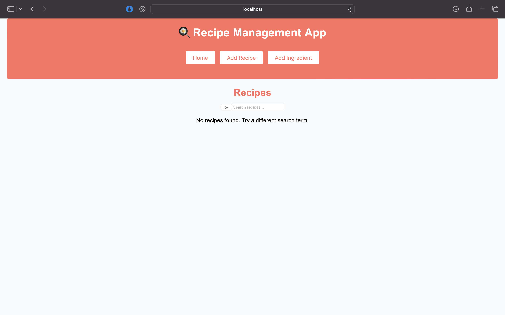

# Cookbook
> #### Date created: November 2024
>
> ##### Written in: **JavaScript, CSS, SQL**
>
> Collaborators: Alanna Zhang, Maddie Dai, Pranav Turlapati
>
> [Github](https://github.com/ElijahWood2003/cookbook-website/tree/main)

We developed a website that stores cookbook recipes and ingredients through SQL in SupabaseDB, with React for the frontend. It supported adding recipes, ingredients, and information on ingredient macros.

Functionality on the database has been removed since the Supabase account managing it was auto-deleted. The frontpage used to show any number of recipes to access, update, or delete.

