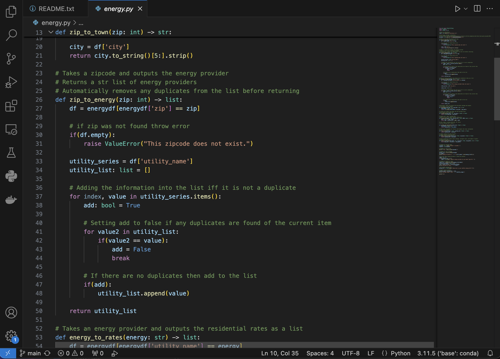

# Energy Estimates
> #### Date created: February 2024
>
> ##### Written in: **Python**
>
> [Github](https://github.com/ElijahWood2003/energy-estimates?tab=readme-ov-file)

During my internship at Helios Solar in Spring 2024, I contributed to a project aimed at accelerating the process of providing solar quotes to customers. This solution utilizes the pandas library to parse CSV files which contain data on energy rates and energy providers for any zip code in the USA. Additionally, it includes functions designed to perform various solar and energy calculations.

