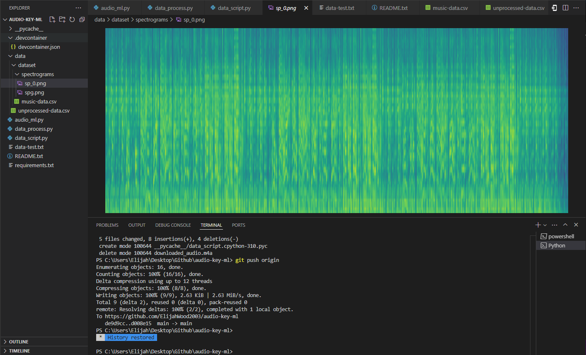

# Music Key ML
> #### Date created: December 2024 - Current
>
> ##### Written in: **Python, SwiftUI**
>
> Collaborators: Ivan Fuentes, Carmine Falconi
>
> [Github](https://github.com/ElijahWood2003/audio-key-ml)

<p>This is a collaborative machine learning project that I am currently engaged on with a small team of colleagues. The objective is to train a machine learning model using an extensive dataset of music to enable the model to find the key-signature of live music being performed.</p>
<p>The model is a CNN (Convolutional Neural Network) built using Tensorflow/Keras. It has several layers each for increased pattern recognition. The current version of the model can be found in Github under <em>/models</em>.</p>

### Creating the Dataset
To create a large dataset with minimal manual labor, I have created a script which takes in a list of text in the format: 
```
[YouTube-music URL], [key-signature] \ENTER
[YouTube-music URL], [key-signature] \ENTER
...
```
Through a series of subscripts, the script outputs this simple input into clean data.
#### Script Output:

1. **Downloads and converts** the Youtube video into a .wav audio file
2. **Stores** the .wav audio file in a local temp directory
3. **Converts** the .wav file into a spectrogram
4. **Stores** the spectrogram in a data directory
5. **Adds the local path** of the spectrogram to a .csv file along with relevant data
6. **Cleans up** all temporary audio/files created

