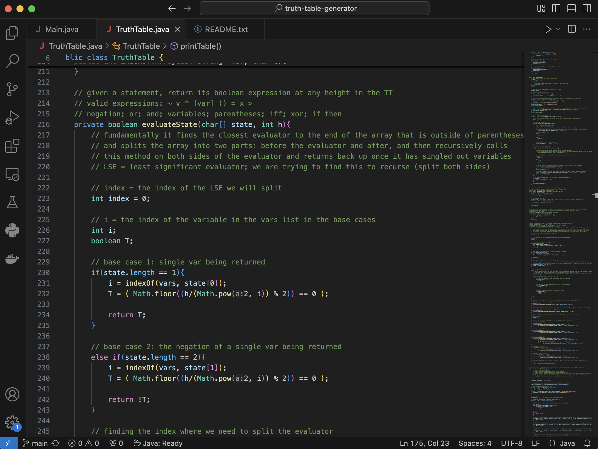
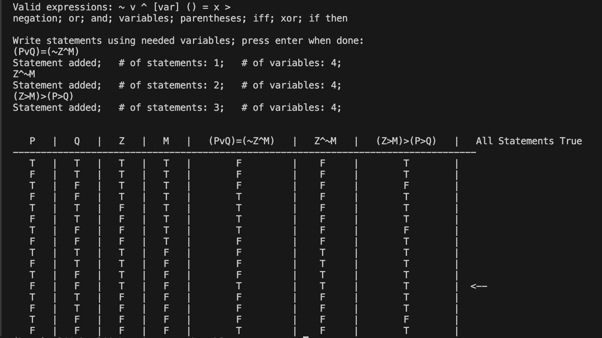

# Truth Table Generator
> #### Date created: December 2023
>
> ##### Written in: **Java**
>
> [Github](https://github.com/ElijahWood2003/truth-table-generator) 

I wrote this over winter break in 2023 with the goal of creating an auto-generating truth table. I was curious to find the best way to parse something like a truth statement for variables and operators.

I found the solution was using a recursive function which finds the "least significant operator" to split the left and right sides into smaller subproblems. I created a set of rules to find the least significant operator, as well as a set of rules to find valid versus invalid statements.

